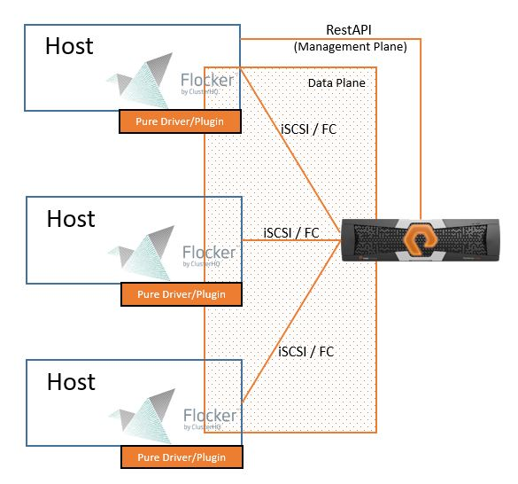

Pure Storage Flocker Driver
===========================
The plugin to provide Pure Storage FlashArray Flocker integration.

## Description
ClusterHQ/Flocker provides an efficient and easy way to connect persistent store with Docker containers. This project provides a plugin to provision resillient storage from Pure Storage.

## Pure Storage Flocker Intergration Block Diagram

## Installation
- Install OpeniSCSI and Multipath tools
    * Ubuntu<br>
    ```bash
    sudo apt-get update
    sudo apt-get install -y open-iscsi multipath-tools python-dev
    ```
    * Centos<br>
    ```bash
    sudo yum -y install iscsi-initiator-utils
    sudo yum -y install device-mapper-multipath
    ```

- Install ClusterHQ/Flocker<br>
https://docs.clusterhq.com/en/latest/

- Install Pure Storage Plugin

    Easiest way:
    
    ```bash
    git clone https://github.com/PureStorage-OpenConnect/purestorage-flocker-driver.git
    pip install purestorage-flocker-driver/
    ```
    The pip install will probably need to be run as root or with sudo depending on the environment. If flocker is running with
    a virtual environment you may need to install into the same one. For example on Ubuntu 14.04, as root, run:

    ```bash
    source /opt/flocker/bin/activate
    git clone https://github.com/PureStorage-OpenConnect/purestorage-flocker-driver.git
    pip install purestorage-flocker-driver/
    ```
    
    Alternatively if pip is not available you can clone or download the driver code and install manually.
    
    ```bash
    git clone https://github.com/PureStorage-OpenConnect/purestorage-flocker-driver.git
    cd purestorage-flocker-driver
    python setup.py install
    ```

- Ensure that `scsi_id` is available on the path for the flocker-dataset-agent service.

    ```bash
    export PATH=$PATH:/lib/udev
    ```

    Alternatively, it may be easier on some systems to simply put a symlink into /bin

    ```bash
    ln /lib/udev/scsi_id /bin/scsi_id
    ```

    This is required for part of the volume attachment process, and is not always in the
    same location depending on the OS.

- (Fibre Channel Only) Setup zoning for compute nodes and FlashArray. The driver assumes that zoning has been configured already and will not attempt to automatically zone any nodes.

## Usage Instructions
To start the driver on a node, a configuration file must exist on the node at /etc/flocker/agent.yml. This should be as follows, replacing ${pure_ip} & ${pure_api} with the ip/hostname and API token of the Pure Storage FlashArray:
```bash
control-service: {hostname: '1.2.3.4', port: 5678}
version: 1
dataset:
    backend: purestorage_flasharray_flocker_driver
    pure_ip: ${pure_ip}
    pure_api_token: ${pure_api}
    pure_storage_protocol: ${pure_storage_protocol}  # Optional
    pure_manage_purity_hosts: ${PURE_MANAGE_PURITY_HOSTS} # Optional
    pure_chap_host_user: ${pure_chap_host_user}  # Optional
    pure_chap_host_password: ${pure_chap_host_password}  # Optional
    pure_verify_https: ${pure_verify_https} # Optional
    pure_ssl_cert: ${pure_ssl_cert}  # Optional
```

### Required Parameters
<dl>
<dt>pure_ip</dt>
<dd>This is the management vip or hostname for the FlashArray.</dd>

<dt>pure_api_token</dt>
<dd>A valid api token for the FlashArray being managed.</dd>
</dl>

### Optional Parameters
<dl>
<dt>pure_manage_purity_hosts</dt>
<dd>When True the driver will automatically create and modify Purity hosts to ensure WWNS, IQNS, and/or CHAP credentials are set correctly. Defaults to True.</dd>

<dt>pure_storage_protocol</dt>
<dd>The type of storage protocol being used. Valid options are ISCSI or FIBRE_CHANNEL.
Defaults to ISCSI.</dd>

<dt>pure_chap_host_user</dt>
<dd>The iSCSI CHAP host username to use. This is only used when pure_storage_protocol is ISCSI. 
To enable CHAP you must set both pure_chap_host_user and pure_chap_host_password.</dd>

<dt>pure_chap_host_password</dt>
<dd>The iSCSI CHAP host password to use. This is only used when pure_storage_protocol is ISCSI. 
To enable CHAP you must set both pure_chap_host_user and pure_chap_host_password.</dd>

<dt>pure_verify_https</dt>
<dd>Force verification of HTTPS requests. When enabled, if the certificates are not trusted requests will fail.
Defaults to False.</dd>

<dt>pure_ssl_cert</dt>
<dd>If pure_verify_https is True then you may specify a path to ca bundle/certificate for use in request validation. Otherwise system defaults will be used.</dd>
</dl>

## Contribution
Create a fork of the project into your own repository. Make all your necessary changes and create a pull request with a description on what was added or removed and details explaining the changes in lines of code. If approved, project owners will merge it.

## Running Tests

Run the tests
```bash
trial tests.test_purestorage
```
This will, by default, look for a configuration file in `/etc/flocker/agent.yml`
If you wish to specify a custom location export a `AGENT_CONFIG_FILE` environment
variable with the full path and it will be used instead. These configuration
files are expected to have the same backend definition as a normal agent.yml
file using a Pure Storage FlashArray backend.

Compatibility
-------------
This plugin has been tested and verified with Flocker 1.12.0 on Ubuntu and CentOS based systems.

It will support Pure FlashArray's running Purity version 3.4.0 and newer.

Licensing
---------
**Pure Storage will not provide legal guidance on which open source license should be used in projects. We do expect that all projects and contributions will have a valid open source license, or align to the appropriate license for the project/contribution**

Copyright [2016] [Pure Storage Inc.]

Some small portions of this driver were forked from the Apache 2.0 licensed repository at https://github.com/dellstorage/storagecenter-flocker-driver, and the appropriate copyrights apply to that portion.

Licensed under the Apache License, Version 2.0 (the "License");
you may not use this file except in compliance with the License.
You may obtain a copy of the License at

    http://www.apache.org/licenses/LICENSE-2.0

Unless required by applicable law or agreed to in writing, software
distributed under the License is distributed on an "AS IS" BASIS,
WITHOUT WARRANTIES OR CONDITIONS OF ANY KIND, either express or implied.
See the License for the specific language governing permissions and
limitations under the License.

Support
-------
Please file bugs and issues at the Github issues page. For more general discussions you can contact the Flocker team at <a href="https://groups.google.com/forum/#!forum/flocker-users">Google Groups</a>. The code and documentation are released with no warranties or SLAs and are intended to be supported through a community driven process.
